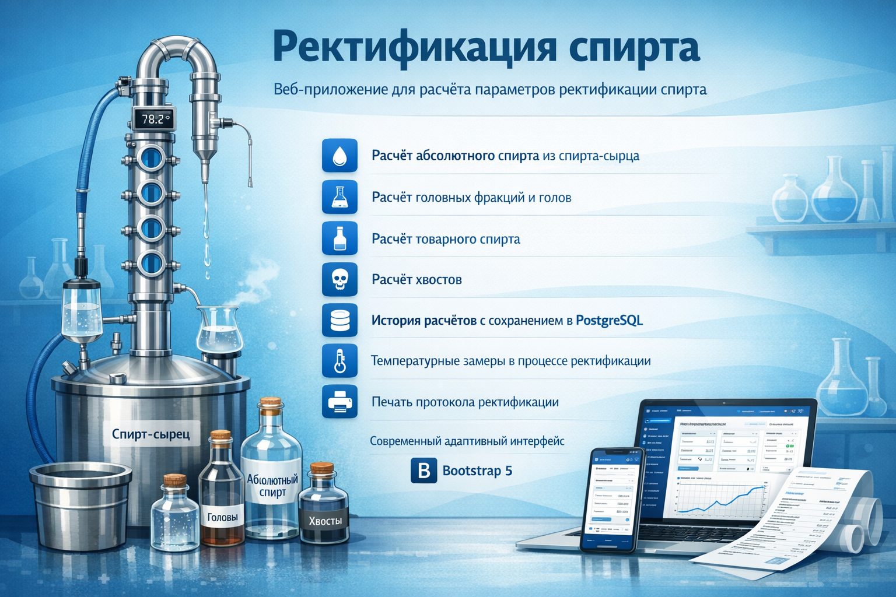

## Возможности

- Расчёт абсолютного спирта из спирта-сырца
- Расчёт головных фракций и голов
- Расчёт товарного спирта
- Расчёт хвостов
- **История расчётов** с сохранением в PostgreSQL
- **Температурные замеры** в процессе ректификации
- **Печать протокола** ректификации
- Современный адаптивный интерфейс (Bootstrap 5)

## Технологии

- Java 17+
- Spring Boot 3.2.5
- Spring Data JPA (Jakarta EE)
- PostgreSQL
- Flyway (миграции)
- Thymeleaf
- Spring Security (form login, CSRF)
- Bootstrap 5
- Maven
- Docker Compose


## Быстрый старт

### С использованием Docker Compose (local-only/dev)


```bash
# Запуск всех сервисов
docker compose up -d

# Остановка
docker compose down
```

Приложение Docker Compose будет доступно по адресу: http://localhost:8089

Этот Docker Compose-файл предназначен только для локальной разработки: порт приложения опубликован как `127.0.0.1:8089:8080`, порт PostgreSQL — как `127.0.0.1:5432:5432`, поэтому сервисы не слушают внешние интерфейсы хоста.

### Локальный запуск


1. Создайте файл `.env` на основе примера:
```bash
cp .env.example .env
# Отредактируйте .env при необходимости
```

2. Запустите PostgreSQL (или используйте Docker)

3. Сборка и запуск:
```bash
mvn clean package
mvn spring-boot:run
```
Приложение будет доступно по адресу: http://localhost:8099

## Настройка .env

```env
# PostgreSQL
POSTGRES_DB=rectification_db
POSTGRES_USER=postgres
POSTGRES_PASSWORD=password
POSTGRES_HOST=rectification-db
POSTGRES_PORT=5432

# Spring Boot
SPRING_DATASOURCE_URL=jdbc:postgresql://rectification-db:5432/rectification_db
SPRING_DATASOURCE_USERNAME=postgres
SPRING_DATASOURCE_PASSWORD=password
SPRING_FLYWAY_REPAIR_ON_MIGRATE=true
```

## Безопасность

Приложение защищено Spring Security: страницы приложения и все изменяющие POST-запросы требуют аутентификации через стандартный form login/logout, CSRF-защита включена и не отключается глобально. Статические ресурсы остаются доступными без входа.

Не коммитьте реальные пароли или секреты. Для локальной разработки можно использовать сгенерированный Spring Boot dev password (пользователь `user`, пароль выводится в логах при старте) или задать учетные данные штатными настройками Spring Security через env/config, например `SPRING_SECURITY_USER_NAME` и `SPRING_SECURITY_USER_PASSWORD`.

Текущие Docker Compose и `.env` примеры предназначены только для локальной разработки: приложение и PostgreSQL в Compose привязаны к `127.0.0.1`. Полное усиление настроек БД, учетных данных и портов выполняется отдельной задачей.


## Структура проекта


```
src/main/
├── java/com/example/rectificat/
│   ├── controller/      # HTTP-контроллеры
│   ├── model/           # Сущности JPA
│   ├── repository/      # Репозитории
│   ├── services/        # Бизнес-логика
│   └── RectificationApplication.java
└── resources/
    ├── application.yml
    ├── db/migration/    # Flyway миграции
    └── templates/       # HTML-шаблоны Thymeleaf
```

## Скрипты

### Бэкап базы данных

```powershell
cd scripts
.\backup.ps1
```

Бэкапы сохраняются в `scripts/backups/`. Автоматически удаляются бэкапы старше 30 дней.

### Восстановление из бэкапа

```powershell
cd scripts
.\restore.ps1
```

## Тестирование

```bash
# Запуск всех тестов
mvn test

# Проверка покрытия кода тестами (JaCoCo)
mvn clean test

# Отчет о покрытии будет создан в target/site/jacoco/index.html
```

## Использование

1. Откройте http://localhost:8099 и войдите через стандартную форму Spring Security
2. Нажмите "Новый расчёт"

3. Введите параметры:
   - Количество спирта-сырца (л)
   - Крепость спирта (%)
   - Мощность (кВт)
   - Вода в узле отбора (мл)
4. Нажмите "Рассчитать"
5. Просмотрите результаты и добавьте температурные замеры
6. Распечатайте протокол при необходимости
